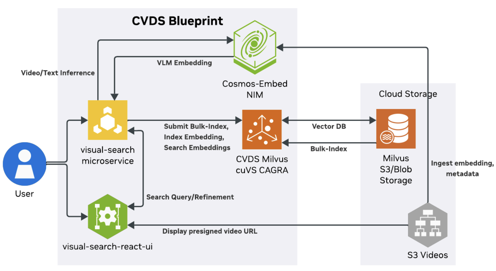

<div align="center">
  <h1>COSMOS Dataset Search</h1>
  <h3>Local Cosmos Dataset Search-style video retrieval over NVIDIA PhysicalAI autonomous-driving clips.</h3>
  <p><sub>Developed during an internship at <strong>CovisionLAB</strong></sub></p>
</div>

---

Local Cosmos Dataset Search-style video retrieval over NVIDIA PhysicalAI autonomous-driving clips.

This repo uses `nvidia/Cosmos-Embed1-448p` to embed videos and text, stores video embeddings in Milvus, serves search through a Flask backend, and serves the browser UI from the same backend.

Architecture:



```text
Hugging Face zips -> mp4 extraction -> Cosmos video embeddings -> Parquet -> Milvus -> Flask backend + viewer
```

## Status

This is a research/internal pipeline with hardcoded constants at the top of the scripts. It is intentionally simple and fail-fast, not a packaged product.

The repository code is licensed under Apache-2.0 as is.

## Requirements

| Requirement | Purpose |
| --- | --- |
| Linux workstation | The scripts use Docker and CUDA tooling. |
| NVIDIA GPU with CUDA | Cosmos embedding inference. |
| Docker | Runs standalone Milvus. |
| `uv` | Creates Python environments and installs packages. |
| Python 3.12 | Backend, embedding, and `physical-ai-av` environment. |
| Hugging Face access | Downloads dataset zips and loads `nvidia/Cosmos-Embed1-448p`. |
| `ffmpeg` / `ffprobe` with NVENC | Downloads and serves browser-playable H.264 MP4s. |
| About 64 GB free space | Temporary zip/download/extract workspace. |
| Milvus disk space | Stores the vector database under `database/volumes/`. |

Runtime services:

| Service | Port | Purpose |
| --- | ---: | --- |
| Milvus standalone | `19530` | Vector database API. |
| Milvus health | `9091` | Container health check. |
| Embedded etcd | `2379` | Milvus internal metadata. |
| Flask backend/viewer | `5000` | API, web UI, and local MP4 serving. |

## Install

```bash
cd your_repo_name
uv sync --frozen
source .venv/bin/activate
```

Login if the model or dataset are not already cached:

```bash
.venv/bin/huggingface-cli login
```

`src/cosmos_cds/backend/app.py` uses `LOCAL_FILES_ONLY = True`, so `nvidia/Cosmos-Embed1-448p` must already exist in the Hugging Face cache before backend startup.

Paths default under `data/` and can be changed without editing code:

| Variable | Default | Purpose |
| --- | --- | --- |
| `COSMOS_CDS_DATA_DIR` | `<repo>/data` | Embeddings, metadata, query manifests, and downloaded clips. |
| `COSMOS_CDS_WORK_DIR` | `<data>/work` | Temporary zip extraction and video staging. |

## Structure

| Path | Purpose |
| --- | --- |
| `src/cosmos_cds/buffered_pipeline/downloader.py` | Downloads NVIDIA PhysicalAI AV zips and extracts `.mp4` files. |
| `src/cosmos_cds/buffered_pipeline/embedder.py` | Embeds extracted videos with `nvidia/Cosmos-Embed1-448p`. |
| `src/cosmos_cds/buffered_pipeline/orchestrator.py` | Streams download/extract/embed with multiple download workers and one embedder process per GPU. |
| `src/cosmos_cds/buffered_pipeline/merge_448_embeddings.py` | Merges 448p Parquet outputs. |
| `run.sh` | Starts Milvus if needed, then starts the backend/viewer if needed. |
| `database/compose.yaml` | Docker Compose config for standalone Milvus. |
| `database/standalone_embed.sh` | Starts/stops/deletes standalone Milvus in Docker. |
| `src/cosmos_cds/database/ingest.py` | Drops existing collections after confirmation, creates `cosmos_cds_test_00`, and ingests the merged Parquet file. |
| `src/cosmos_cds/backend/app.py` | Unified Flask app: serves `/viewer/`, embeds queries, searches Milvus, starts downloads, serves MP4s. |
| `src/cosmos_cds/backend/download_video_list.py` | Worker used by `/download`; extracts result clips through `physical-ai-av` and transcodes them. |
| `src/cosmos_cds/web_viewer/` | Browser UI assets served by the backend. |

## Generated Data

These paths are generated and should not be committed:

| Path | Meaning |
| --- | --- |
| `data/work/` | Temporary zip and extraction workspace. |
| `data/buffered_pipeline/` | Parquet embeddings, reports, and shards. |
| `data/clips/` | Downloaded shared clips. |
| `data/<query>/` | Downloaded query manifests. |
| `database/volumes/` | Docker Milvus persistent data. |
| `$TMPDIR/cosmos_cds_download_requests/` | Backend download job request/progress files. |
| `$TMPDIR/cosmos_cds_video_queries/` | Uploaded video-query files. |

Generated embeddings from gated or restricted datasets should stay local unless the dataset owner explicitly permits redistribution.

## Build Embeddings

The workspace defaults to `data/work`. To use a larger disk instead:

```bash
export COSMOS_CDS_WORK_DIR=/path/to/workspace
```

Edit the constants at the top of `src/cosmos_cds/buffered_pipeline/orchestrator.py` before a run:

| Constant | Meaning |
| --- | --- |
| `START_ZIP` | First dataset zip index. |
| `ZIP_LIMIT` | Number of zips to process. |
| `GPU_IDS` | GPUs used for embedding. |
| `DOWNLOAD_WORKERS` | Parallel zip download/extract workers. |
| `MAX_READY_ZIPS` | Maximum staged zips waiting for embedding. |
| `MAX_RAM_GB` | Maximum intended workspace usage. |

Run the streaming pipeline:

```bash
python -m cosmos_cds.buffered_pipeline.orchestrator
```

The current merged 448p embedding artifact expected by ingest is:

```text
data/buffered_pipeline/embeddings_0000_3145.448.parquet
```

## Start Milvus

```bash
bash database/standalone_embed.sh start
```

Check:

```bash
docker ps
curl http://127.0.0.1:9091/healthz
```

Stop or delete:

```bash
bash database/standalone_embed.sh stop
bash database/standalone_embed.sh delete
```

## Ingest

`src/cosmos_cds/database/ingest.py` is destructive by design: it asks for `DELETE`, drops all existing Milvus collections, creates `cosmos_cds_test_00`, and inserts the configured Parquet embeddings.

```bash
python -m cosmos_cds.database.ingest
```

Milvus collection settings:

| Setting | Value |
| --- | --- |
| Collection | `cosmos_cds_test_00` |
| Vector field | `embedding` |
| Dimension | `768` |
| Metric | `COSINE` |
| Output fields | `video_path`, `chunk` |

## Run App

Start the unified backend/viewer:

```bash
./run.sh
```

`run.sh` starts Milvus through Docker Compose when needed, then starts the Flask backend in the foreground.

Open:

```text
http://127.0.0.1:5000/viewer/
```

The viewer supports:

| Action | Meaning |
| --- | --- |
| Word query | Embeds text and searches Milvus. |
| Video query | Uploads a local video, embeds it, and searches Milvus. |
| Download data | Saves query manifests under `data/{query}/` and MP4s in the optional UI output directory, or `data/clips/` by default. |
| History | Lists previously downloaded query folders and re-runs them. |
| Copy path | Copies the displayed local or source video path from a result card. |
| Video playback | Serves default clips through `/video/{query}/{clip_id}.mp4` and custom-output clips through their download job. |

API:

| Endpoint | Meaning |
| --- | --- |
| `GET /health` | Backend status. |
| `GET /viewer/` | Web UI. |
| `GET /history` | Downloaded query folders. |
| `DELETE /history/<query_name>` | Deletes one query manifest and prunes unreferenced shared clips. |
| `GET /search?word=pickup&quantity=5` | Text-to-video search. |
| `POST /search_video` | Video-to-video search. |
| `POST /download` | Starts a background clip download job; accepts an optional `output_dir`. |
| `GET /download/<job_id>` | Polls download job progress. |
| `GET /video/<query_name>/<filename>` | Serves a downloaded MP4. |

## Normal Startup

If embeddings are already loaded into Milvus:

```bash
./run.sh
```

Then open `http://127.0.0.1:5000/viewer/`.

## Known Limitations

- Scripts use constants rather than CLI arguments.
- `src/cosmos_cds/backend/app.py` loads one Cosmos model on startup and expects Milvus to already contain the collection.
- `/download` needs `physical-ai-av` and working NVIDIA dataset access.
- MP4 download/transcode expects `ffmpeg`, `ffprobe`, and NVENC support.

## License

The repository code and documentation are licensed under the Apache License, Version 2.0. See `LICENSE` and `NOTICE.md`.
